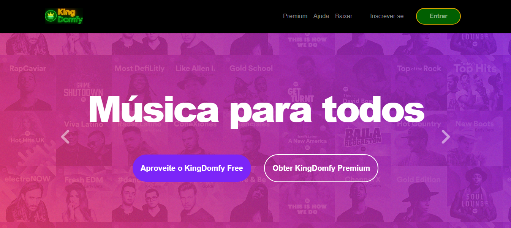

<h2 id="sobre-o-projeto">1. 🎵 King-Domfy - Música para Todos 🎵🎵</h2>


[](https://github.com/Domisnnet/King-Domfy/blob/main/LICENSE)



Bem-vindo ao **King-Domfy**! Uma recriação de interface inspirada no Spotify, focada em entregar uma experiência de usuário fluida, com design responsivo e componentes modernos. Explore playlists, álbuns e uma interface pensada para todos os dispositivos.

---

## 📚 Tabela de Conteúdo

| 🎧 O Projeto | 🛠️ Técnico | 🤝 Comunidade |
| :---: | :---: | :---: |
| [](#sobre-o-projeto) | [](#destaques-tecnicos) | [](#codigo-fonte) |
| [](#tecnologias-utilizadas) | [](#codigo-fonte) | [](#créditos) |
| [](#como-acessar) | [](#como-contribuir) | [](#licenca) |
| [](#funcionalidades) | [](#faq) | [](#perfil-do-github) |

---

<h2 id="tecnologias-utilizadas">2. ⚙️ Tecnologias Utilizadas</h2>

| Camada | Tecnologias | Descrição |
| :--- | :--- | :--- |
| **Frontend** |   | Estrutura semântica e estilização personalizada. |
| **Framework UI** |  | Grid responsivo e componentes de interface. |
| **Interatividade** |  | Lógica para carrosséis e comportamento do menu. |
| **Icons** |  | Tipografia icônica e elementos visuais. |

---

<h2 id="como-acessar">3. 🚀 Como Acessar</h2>

Clique no botão abaixo para iniciar a experiência King-Domfy diretamente no seu navegador:

<div align="left">
  <a href="https://domisnnet.github.io/King-Domfy-Web-Essentials/" target="_blank">
    
  </a>
</div>

---

<h2 id="funcionalidades">4. 🧩 Funcionalidades Principais</h2>

O projeto foca na fidelidade visual e usabilidade da plataforma original:

| Funcionalidade | Descrição |
| :--- | :--- |
| 📱 **Responsividade** | Interface adaptável para Mobile, Tablet e Desktop via Bootstrap. |
| 🎠 **Carrossel Interativo** | Exibição dinâmica de lançamentos e destaques com transições suaves. |
| 🧭 **Navegação Smart** | Menu responsivo (hambúrguer) para fácil acesso em telas menores. |
| 🎨 **UI Consistente** | Replicagem de cores, fontes e espaçamentos da identidade Spotify. |
| 🔗 **Footer Completo** | Rodapé estruturado com links de comunidade e redes sociais. |

---

<h2 id="destaques-tecnicos">5. 💻 Destaques Técnicos</h2>

Como um projeto de recriação de interface, os principais desafios superados foram:

### 📐 Grid e Flexbox
Uso intensivo do sistema de grids do **Bootstrap** para garantir que as seções de "Músicas" e "Playlists" mantenham o alinhamento perfeito, independente da resolução do usuário.

### 🔄 Manipulação de Carrosséis
Implementação de controles customizados para o carrossel, garantindo que a experiência de navegação entre os banners seja intuitiva e performática.

---

<h2 id="instalacao-local">6. 🚀 Instalação e Configuração Local</h2>

```bash
# Clonar o repositório
git clone [https://github.com/Domisnnet/King-Domfy-Web-Essentials.git](https://github.com/Domisnnet/King-Domfy-Web-Essentials.git)

# Acessar a pasta
cd King-Domfy-Web-Essentials
```

---

<h2 id="como-contribuir">7. 🤝 Como Contribuir</h2>

Siga os passos abaixo para fortalecer este projeto:

| Fase | Ação | Link / Comando |
| :---: | :--- | :--- |
| **01** | **Fork** | [](https://github.com/Domisnnet/King-Domfy-Web-Essentials/fork) |
| **02** | **Branch** | `git checkout -b feature/MinhaMelhoria` |
| **03** | **Commit** | `git commit -m 'feat: nova seção de álbuns'` |
| **04** | **Push** | `git push origin feature/MinhaMelhoria` |
| **05** | **PR** | [](https://github.com/Domisnnet/King-Domfy-Web-Essentials/compare) |

### 🐛 Encontrou um problema?
Se algo não estiver funcionando como esperado, não hesite em abrir um chamado:

[](https://github.com/Domisnnet/King-Domfy-Web-Essentials/issues)
[](https://github.com/Domisnnet/King-Domfy-Web-Essentials/issues/new)

---

<h2 id="faq">8. 🧠 Perguntas Frequentes</h2>

<details>
<summary><strong>O layout é 100% fiel ao Spotify atual ❓</strong></summary>
<p>🎨 <strong>Resposta:</strong> O King-Domfy foi inspirado em uma versão específica (clássica) da interface. O objetivo foi capturar a essência da marca, priorizando a organização visual e o contraste de cores característico, adaptando alguns elementos para melhor performance web.</p>
</details>

<details>
<summary><strong>Como foi garantida a responsividade sem usar React/Vue ❓</strong></summary>
<p>📱 <strong>Resposta:</strong> Utilizamos o sistema de <strong>Grid e Containers do Bootstrap 5</strong> combinado com <strong>Media Queries</strong> personalizadas no CSS3. Isso permite que os cards de álbuns se reajustem de 4 colunas no Desktop para apenas 1 ou 2 no Mobile, mantendo a legibilidade.</p>
</details>

<details>
<summary><strong>O carrossel de banners é otimizado ❓</strong></summary>
<p>🔄 <strong>Resposta:</strong> Sim! Implementamos o componente <code>Carousel</code> do Bootstrap com transições via hardware acceleration (CSS transitions), o que garante que a navegação entre os banners seja suave, sem travamentos mesmo em dispositivos mais lentos.</p>
</details>

<details>
<summary><strong>Posso utilizar este código em meu portfólio pessoal ❓</strong></summary>
<p>🤝 <strong>Resposta:</strong> Com certeza. O projeto é <strong>Open Source</strong>. Você pode clonar, estudar a estrutura de pastas e utilizar como base para seus próprios estudos de UI, desde que mantenha a atribuição original conforme a licença MIT e dê os devidos créditos.</p>
</details>

<details>
<summary><strong>Por que utilizar Bootstrap em vez de Tailwind ou CSS Puro ❓</strong></summary>
<p>🛠️ <strong>Resposta:</strong> A escolha do Bootstrap foi estratégica para agilizar o desenvolvimento de componentes complexos (como modais e menus colapsáveis) e garantir uma base sólida de acessibilidade e padronização que o framework oferece nativamente.</p>
</details>

<details>
<summary><strong>Como entro em contato para sugestões ou bugs ❓</strong></summary>
<p>📩 <strong>Resposta:</strong> A melhor forma é abrindo uma <strong>Issue</strong> no repositório ou entrando em contato via perfil do GitHub. Adoramos receber feedbacks sobre melhorias na interface!</p>
</details>

---

<h2 id="codigo-fonte">9. 💻 Código Fonte</h2>

Deseja analisar a estrutura do projeto? Explore o repositório oficial:

[](https://github.com/Domisnnet/King-Domfy-Web-Essentials)

---

<h2 id="créditos">10. 📝 Créditos & Reconhecimentos</h2>

O **King-Domfy** é o resultado de esforço técnico e inspiração em grandes players do mercado. Abaixo, os pilares que tornaram este projeto possível:

| Atribuição | Responsável / Recurso | Descrição |
| :--- | :--- | :--- |
| **Arquitetura & Dev** | **DomisDev** | Idealização, estruturação do código e implementação da lógica responsiva. |
| **Identidade Visual** | **Spotify Inc.** | Referência de Design System, paleta de cores e UX. |
| **Engine Gráfica** | **Bootstrap & CSS3** | Fornecimento dos componentes de layout e estilização moderna. |
| **Assets Visuais** | **Font Awesome & Devicons** | Ícones de alta fidelidade que compõem a estética da interface. |
| **Aprendizado** | **Comunidade Dev** | Baseado em princípios de Clean Code e boas práticas de Front-end. |

### 🎯 Missão do Projeto
> "Este projeto foi construído com o propósito de demonstrar que interfaces complexas podem ser recriadas com precisão utilizando tecnologias fundamentais da web, servindo de base para estudos de UI/UX e performance."


---

<h2 id="licenca">11. 📄 Licença</h2>

Este projeto está licenciado sob a [](https://github.com/Domisnnet/King-Domfy-Web-Essentials/blob/main/LICENSE)

---

<h2 id="perfil-do-github">12. 👨‍💻 Perfil do GitHub</h2>

<a href="https://github.com/Domisnnet"> 
   
</a>
